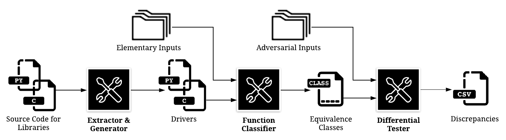
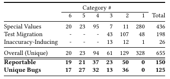

# FPDiff


### This is the artifact accompanying the ISSTA'20 paper "Discovering Discrepancies in Numerical Libraries".



FPDiff is a tool for automated, end-to-end differential
testing that, given only library source code as input,
extracts numerical function signatures, synthesizes drivers, creates
equivalence classes of functions that are synonymous, and executes
differential tests over these classes to detect meaningful numerical
discrepancies between implementations. FPDiff's current scope covers
special functions across numerical libraries written in different
programming languages. This artifact in particular includes the
following libraries: the C library `GSL` (The GNU Scientific Library,
version 2.6), the Python libraries `SciPy` (version 1.3.1) and
`mpmath` (version 1.1.0), and the JavaScript library `jmat` (commit
21d15fc3eb5a924beca612e337f5cb00605c03f3).

In following this README, we will run the tool end-to-end to generate
results and then evaluate those results. This evaluation involves
comparing the generated logs against a set of expected results,
reconstructing all the examples used in the paper, and reconstructing
the information in Table 4 which represent the final results of
FPDiff. (Note that Table 1 simply describes our categorization of
discrepancies and Tables 2, 3, and 5 are the results of manual
inspection; supporting data can be found in the
`resources/spreadsheets` directory, with a discussion in __[3.2]__.)

__[0]__ _Requirements_ 

__[1]__ _Running FPDiff_
 
------------__[1.1]__ _Running FPDiff on all discoverable functions_
 
------------__[1.2]__ _Running FPDiff on a representative subset of functions_

__[2]__ _Evaluating Results: Consistency with the Paper_

------------__[2.1]__ _Running Automated Checks_

------------__[2.2]__ _Reconstructing Examples_

------------__[2.3]__ _Reconstructing Tables_

__[3]__ _Supplemental Material_

------------__[3.1]__ _Descriptions of Intermediate Results_

------------__[3.2]__ _Spreadsheets_

------------__[3.3]__ _Adding New Libraries_

## [0] Requirements
All requirements for running FPDiff are packaged in a 1.3GB docker
image. As such, the host machine must have `docker` installed. If you
receive a permissions error when running the commands in this README,
[check to make sure that your user is in the `docker`
group](https://docs.docker.com/engine/install/linux-postinstall/#manage-docker-as-a-non-root-user).

_Note that the execution times listed below for running FPDiff do not
include the time required to download the docker image._  When
executing the pipeline for the first time, the image
will be downloaded __automatically__ if not found locally. Optionally,
one can also run the command below to acquire the docker image
manually.

```
$ docker pull ucdavisplse/sp-diff-testing/artifact
```

A Dockerfile and the `build.sh` script called by that Dockerfile are
included so that those interested may view the requirements packaged
in the docker image and/or build the image locally.

The artifact was tested on a workstation with a 3.60 GHz Intel i7-4790
and 32 GB of RAM running Ubuntu 16.04.

## [1] Running FPDiff
This artifact provides two choices for the running of FPDiff: (1) An
execution on all discoverable functions which will take longer but
will reproduce the full results of the paper and (2) An execution on a
subset of functions which is much quicker but provides only a subset
of representative results. _The subset execution need not be undertaken
if the full run is performed;_ it is provided as a convenience.
Hyperparameters for FPDiff executions may be adjusted by editing `header.py`.

### [1.1] Running FPDiff on all discoverable functions (approx. 1 hour)
```
$ nohup ./run.sh
```

From the same directory containing this README, execute the above
command. This will automatically download the docker image with all
the dependencies if it is not found locally, spin up a container,
mount the `workspace` directory in that container, and execute
`workspace/runExperiment.sh` to conduct a full pipeline execution.
FPDiff will parse the source code of the libraries, extract function
signatures, generate drivers for those functions, place them in
equivalence classes, and finally perform differential testing to
discover numerical discrepancies.


### [1.2] Running FPDiff on a subset of representative functions (approx. 8 minutes)
```
$ nohup ./run.sh subset
```

The subset execution need not be undertaken if the full run is
performed, though it may be opted for as a convenience. __Please note
that because the above command only generates a subset of results, the
portion of the evaluation described in [2.3] re: reconstruction of
tables cannot be completed.__

From the same directory containing this README, execute the above
command. This will conduct an FPDiff execution in a manner similar to
that described above but on a subset of all discoverable functions in
the libraries. This subset encompasses ~13% of the equivalence classes
and ~25% of the discrepancies discovered by the full run. It also
includes all of the examples used in the paper.

## [2] Evaluating Results: Consistency with the Paper
This evaluation involves comparing the generated logs against a set of
expected logs, reconstructing all the examples used in the paper, and
reconstructing the information in Table 4 which represent the final
results of FPDiff. (Note that Table 1 simply describes our
categorization of discrepancies and Tables 2 and 3 are the results of
manual inspection; the supporting data can be found in the
`resources/spreadsheets` directory.) FPDiff will generate results that can be
found in `workspace/logs`. Depending on the choice made with respect
to the scope of the FPDiff execution, expected results can be found in
either `frozenState/full_logs` or `frozenState/subset_logs`.

__Contents of the `logs` directory:__ `equivalenceClasses.csv` and
`reducedDiffTestingResults.csv` contain main results. `statistics.txt`
contains stats generated from each component of FPDiff, giving an
overview of the pipeline execution. These files are used to
demonstrate consistency with the paper (see __[2.2]__ and __[2.3]__). Files with leading underscores
contain information on intermediate results from the different
pipeline components. See __[3.1]__ for a breakdown of these files.

### [2.1] Running Automated Checks
```
$ ./check.sh
```

To perform an automated series of checks, execute the above command.
This will perform a diff between the generated `statistics.txt` and
the expected results kept in the `frozenState` directory (thus
verifying information which is used to populate the tables, described
in __[2.3]__) as well conduct a search of the generated logs for the
examples used in the paper (described in __[2.2]__).

__Expected Output.__ The expected output is a series of `[PASS]` tags.
However, off-by-one differences might be observed in `statistics.txt`,
denoted by a `[!]` tag and printouts of the offending lines. These
differences are sometimes caused by the flakiness of [SciPy's
implementation](https://docs.scipy.org/doc/scipy/reference/generated/scipy.special.hyperu.html)
of [Tricomi's confluent hypergeometric
function](https://mathworld.wolfram.com/ConfluentHypergeometricFunctionoftheSecondKind.html)
or some non-determinism with respect to detection of timeouts which
can be affected by other processes running on the machine or the
hardware itself.

__Further Investigating Any Differences.__ If faced with off-by-one
differences in `statistics.txt` and further investigation is desired,
running the command below will re-perform the above checks with an
additional line-by-line diff of _all_ logs, printing the `EXPECTED`
lines and the corresponding `GENERATED` lines (if any).

```
./check.sh verbose
```

Confirm that any offending lines pertain to discrepancies that include
`EXCEPTION: TIMEOUT` or discrepancies involving the equivalence class
of the Tricomi confluent hypergeometric function described above. See
below for an excerpt of the verbose check script's output that exhibits
the latter of the two for one particular FPDiff execution.

```
   In reducedDiffTestingResults.csv:

	EXPECTED: 
		< 8327fff0b9f85b3e5ce4a6c6e345fd34,277.9439994014186,2,gsl_sf_hyperg_U_DRIVER~input_num038,"[-10.5, 100.4, 80.0]",mpmath,mpmath_hyperu_arg3_DRIVER0,hyperu,203411319101444.38,,,3.0
		< 8327fff0b9f85b3e5ce4a6c6e345fd34,277.9439994014186,2,gsl_sf_hyperg_U_DRIVER~input_num038,"[-10.5, 100.4, 80.0]",mpmath,mpmath_fp_hyperu_arg3_DRIVER0,hyperu,203411299428896.34,,,3.0
		< 8327fff0b9f85b3e5ce4a6c6e345fd34,277.9439994014186,2,gsl_sf_hyperg_U_DRIVER~input_num038,"[-10.5, 100.4, 80.0]",scipy,scipy_special_hyperu_arg3_DRIVER0,hyperu,nan,,,3.0
		< 8327fff0b9f85b3e5ce4a6c6e345fd34,277.9439994014186,2,gsl_sf_hyperg_U_DRIVER~input_num038,"[-10.5, 100.4, 80.0]",gsl,gsl_sf_hyperg_U_DRIVER,gsl_sf_hyperg_U,203411319101444.4,,,3.0
	GENERATED:
		> 8327fff0b9f85b3e5ce4a6c6e345fd34,277.9439994014186,2,gsl_sf_hyperg_U_DRIVER~input_num026,"[-10.5, 1.1, 50.0]",mpmath,mpmath_hyperu_arg3_DRIVER0,hyperu,3.661978424114089e+16,,,3.0
		> 8327fff0b9f85b3e5ce4a6c6e345fd34,277.9439994014186,2,gsl_sf_hyperg_U_DRIVER~input_num026,"[-10.5, 1.1, 50.0]",mpmath,mpmath_fp_hyperu_arg3_DRIVER0,hyperu,3.661978424114079e+16,,,3.0
		> 8327fff0b9f85b3e5ce4a6c6e345fd34,277.9439994014186,2,gsl_sf_hyperg_U_DRIVER~input_num026,"[-10.5, 1.1, 50.0]",scipy,scipy_special_hyperu_arg3_DRIVER0,hyperu,nan,,,3.0
		> 8327fff0b9f85b3e5ce4a6c6e345fd34,277.9439994014186,2,gsl_sf_hyperg_U_DRIVER~input_num026,"[-10.5, 1.1, 50.0]",gsl,gsl_sf_hyperg_U_DRIVER,gsl_sf_hyperg_U,3.661978424114087e+16,,,3.0
	EXPECTED: 
		< caba0b6725c770243091e62e26223111,277.9439994014186,3,gsl_sf_hyperg_U_DRIVER~input_num040,"[-10.5, 100.4, 200.0]",mpmath,mpmath_hyperu_arg3_DRIVER0,hyperu,1.4308157061056496e+20,"{'mpmath_hyperu_arg3_DRIVER0/mpmath_fp_hyperu_arg3_DRIVER0': 2602074112.0, 'mpmath_hyperu_arg3_DRIVER0/scipy_special_hyperu_arg3_DRIVER0': 2.3581816497391957e+20, 'mpmath_hyperu_arg3_DRIVER0/gsl_sf_hyperg_U_DRIVER': 2064384.0, 'mpmath_fp_hyperu_arg3_DRIVER0/scipy_special_hyperu_arg3_DRIVER0': 2.358181649713175e+20, 'mpmath_fp_hyperu_arg3_DRIVER0/gsl_sf_hyperg_U_DRIVER': 2600009728.0, 'scipy_special_hyperu_arg3_DRIVER0/gsl_sf_hyperg_U_DRIVER': 2.358181649739175e+20}","{'mpmath_hyperu_arg3_DRIVER0/mpmath_fp_hyperu_arg3_DRIVER0': 1.8185948762792842e-11, 'mpmath_hyperu_arg3_DRIVER0/scipy_special_hyperu_arg3_DRIVER0': 2.0, 'mpmath_hyperu_arg3_DRIVER0/gsl_sf_hyperg_U_DRIVER': 1.4428021660586828e-14, 'mpmath_fp_hyperu_arg3_DRIVER0/scipy_special_hyperu_arg3_DRIVER0': 2.0, 'mpmath_fp_hyperu_arg3_DRIVER0/gsl_sf_hyperg_U_DRIVER': 1.8171520741132256e-11, 'scipy_special_hyperu_arg3_DRIVER0/gsl_sf_hyperg_U_DRIVER': 2.0}",4.5
		< caba0b6725c770243091e62e26223111,277.9439994014186,3,gsl_sf_hyperg_U_DRIVER~input_num040,"[-10.5, 100.4, 200.0]",mpmath,mpmath_fp_hyperu_arg3_DRIVER0,hyperu,1.4308157060796288e+20,"{'mpmath_hyperu_arg3_DRIVER0/mpmath_fp_hyperu_arg3_DRIVER0': 2602074112.0, 'mpmath_hyperu_arg3_DRIVER0/scipy_special_hyperu_arg3_DRIVER0': 2.3581816497391957e+20, 'mpmath_hyperu_arg3_DRIVER0/gsl_sf_hyperg_U_DRIVER': 2064384.0, 'mpmath_fp_hyperu_arg3_DRIVER0/scipy_special_hyperu_arg3_DRIVER0': 2.358181649713175e+20, 'mpmath_fp_hyperu_arg3_DRIVER0/gsl_sf_hyperg_U_DRIVER': 2600009728.0, 'scipy_special_hyperu_arg3_DRIVER0/gsl_sf_hyperg_U_DRIVER': 2.358181649739175e+20}","{'mpmath_hyperu_arg3_DRIVER0/mpmath_fp_hyperu_arg3_DRIVER0': 1.8185948762792842e-11, 'mpmath_hyperu_arg3_DRIVER0/scipy_special_hyperu_arg3_DRIVER0': 2.0, 'mpmath_hyperu_arg3_DRIVER0/gsl_sf_hyperg_U_DRIVER': 1.4428021660586828e-14, 'mpmath_fp_hyperu_arg3_DRIVER0/scipy_special_hyperu_arg3_DRIVER0': 2.0, 'mpmath_fp_hyperu_arg3_DRIVER0/gsl_sf_hyperg_U_DRIVER': 1.8171520741132256e-11, 'scipy_special_hyperu_arg3_DRIVER0/gsl_sf_hyperg_U_DRIVER': 2.0}",4.5
		< caba0b6725c770243091e62e26223111,277.9439994014186,3,gsl_sf_hyperg_U_DRIVER~input_num040,"[-10.5, 100.4, 200.0]",scipy,scipy_special_hyperu_arg3_DRIVER0,hyperu,-9.273659436335461e+19,"{'mpmath_hyperu_arg3_DRIVER0/mpmath_fp_hyperu_arg3_DRIVER0': 2602074112.0, 'mpmath_hyperu_arg3_DRIVER0/scipy_special_hyperu_arg3_DRIVER0': 2.3581816497391957e+20, 'mpmath_hyperu_arg3_DRIVER0/gsl_sf_hyperg_U_DRIVER': 2064384.0, 'mpmath_fp_hyperu_arg3_DRIVER0/scipy_special_hyperu_arg3_DRIVER0': 2.358181649713175e+20, 'mpmath_fp_hyperu_arg3_DRIVER0/gsl_sf_hyperg_U_DRIVER': 2600009728.0, 'scipy_special_hyperu_arg3_DRIVER0/gsl_sf_hyperg_U_DRIVER': 2.358181649739175e+20}","{'mpmath_hyperu_arg3_DRIVER0/mpmath_fp_hyperu_arg3_DRIVER0': 1.8185948762792842e-11, 'mpmath_hyperu_arg3_DRIVER0/scipy_special_hyperu_arg3_DRIVER0': 2.0, 'mpmath_hyperu_arg3_DRIVER0/gsl_sf_hyperg_U_DRIVER': 1.4428021660586828e-14, 'mpmath_fp_hyperu_arg3_DRIVER0/scipy_special_hyperu_arg3_DRIVER0': 2.0, 'mpmath_fp_hyperu_arg3_DRIVER0/gsl_sf_hyperg_U_DRIVER': 1.8171520741132256e-11, 'scipy_special_hyperu_arg3_DRIVER0/gsl_sf_hyperg_U_DRIVER': 2.0}",4.5
		< caba0b6725c770243091e62e26223111,277.9439994014186,3,gsl_sf_hyperg_U_DRIVER~input_num040,"[-10.5, 100.4, 200.0]",gsl,gsl_sf_hyperg_U_DRIVER,gsl_sf_hyperg_U,1.4308157061056289e+20,"{'mpmath_hyperu_arg3_DRIVER0/mpmath_fp_hyperu_arg3_DRIVER0': 2602074112.0, 'mpmath_hyperu_arg3_DRIVER0/scipy_special_hyperu_arg3_DRIVER0': 2.3581816497391957e+20, 'mpmath_hyperu_arg3_DRIVER0/gsl_sf_hyperg_U_DRIVER': 2064384.0, 'mpmath_fp_hyperu_arg3_DRIVER0/scipy_special_hyperu_arg3_DRIVER0': 2.358181649713175e+20, 'mpmath_fp_hyperu_arg3_DRIVER0/gsl_sf_hyperg_U_DRIVER': 2600009728.0, 'scipy_special_hyperu_arg3_DRIVER0/gsl_sf_hyperg_U_DRIVER': 2.358181649739175e+20}","{'mpmath_hyperu_arg3_DRIVER0/mpmath_fp_hyperu_arg3_DRIVER0': 1.8185948762792842e-11, 'mpmath_hyperu_arg3_DRIVER0/scipy_special_hyperu_arg3_DRIVER0': 2.0, 'mpmath_hyperu_arg3_DRIVER0/gsl_sf_hyperg_U_DRIVER': 1.4428021660586828e-14, 'mpmath_fp_hyperu_arg3_DRIVER0/scipy_special_hyperu_arg3_DRIVER0': 2.0, 'mpmath_fp_hyperu_arg3_DRIVER0/gsl_sf_hyperg_U_DRIVER': 1.8171520741132256e-11, 'scipy_special_hyperu_arg3_DRIVER0/gsl_sf_hyperg_U_DRIVER': 2.0}",4.5

```

Parsing the meaning of this output:
 - We can tell these differences pertain to discrepancies involving
   the Tricomi functions due to the presence of the function signature
   (`gsl_sf_hyperg_U` for `GSL` and `hyperu` for the other libraries)
   
 - The first pair of `EXPECTED`/`GENERATED` tags indicates that
discrepancy `8327fff0b9f85b3e5ce4a6c6e345fd34`, though still present
in the generated logs, differed from the expected discrepancy because
the input that caused it was different (`[-10.5, 1.1, 50.0]` rather than
`[-10.5, 100.4, 80.0]`).

 - The second `EXPECTED` tag indicates that discrepancy
`caba0b6725c770243091e62e26223111` went missing.

### [2.2] Reconstructing Examples

All examples used in the paper can be found in the generated CSV files of results by searching for the unique discrepancyNo or classKey:

In `reducedDiffTestingResults.csv`:
 - discrepancyNo `84158476b467087661551d71e0601aae`
    - Page 2, Section 2.1, illustrative example
 - discrepancyNo `64185faeeed48d4ead067d29d2c29343`
    - Page 9, Section 4.3, category 2 discrepancy
 - discrepancyNo `253319312b81faac256c91080b348dce`
    - Page 9, Section 4.3, category 3 discrepancy
 - discrepancyNo `2a4001efcc956759a8c8aa671adf8660`
    - Page 9, Section 4.3, first category 4 discrepancy
 - discrepancyNo `2c0bf95be8f8338ac9765024546c0749`
    - Page 9, Section 4.3, second category 4 discrepancy

In `__diffTestingResults.csv`:
 - discrepancyNo `dd258915e38973f68f699a46179c2559`
    - Page 9, Section 4.3, category 6 discrepancy

In `equivalenceClasses.csv`:
 - classKey `24.44048792293956`
    - Page 8, Section 4.2, equivalence class of the [Bessel function of the first kind](https://mathworld.wolfram.com/BesselFunctionoftheFirstKind.html)

### [2.3] Reconstructing Tables

Table 1 simply describes our categorization of discrepancies. Tables
2, 3, and 5 are the results of manual inspection; supporting data can
be found in the `resources/spreadsheets` directory with a discussion
in __[3.2]__. This section therefore will focus on replicating Table 4
which presents the final results of FPDiff. __Please note that this
reconstruction can only be done if executing the full pipeline as
described in [1.1]__. Otherwise, the generated `statistics.txt` will
not contain the full results presented in the paper.



<!--
Since the time of our initial submission, some components of FPDiff
have been refactored. The table above represents the updated results
of these changes; reviewers are encouraged to compare these numbers to
the corresponding table in the initial submission and note that the
last two rows representing our final results are either comparable or
show improvement (higher numbers being better). For the sake of
transparency, notable changes included:

- fixed a bug that resulted in a miscount of an intermediate result.
  _All_ discrepancies caused by inaccuracy-inducing adversarial inputs
  were counted rather than _unique_ discrepancies as in all other
  totals. While this had no effect on the overall count which
  constituted the main result, it did cause an overcount in row 3 of
  Table 4
- removed a dependency used to run JavaScript that would occasionally
  crash and generate false discrepancies
- changed the strategy for tagging extracted signatures, thus yielding
  more discovered signatures, more equivalence classes (126 vs 122), and
  ultimately new discrepancies
- refined timeout detection
-->

Rows 1-4 of this table can be reconstructed from information present in
`statistics.txt`. Shown below is an excerpt of the relevant statistics
from the expected results of a full run:

```
specialValue_unique_discrepancyTally: [20, 23, 95, 7, 11, 280]
testMigration_unique_discrepancyTally: [0, 0, 0, 43, 107, 48]
s3fp_unique_discrepancyTally: [0, 0, 0, 13, 12, 1]

UNIQUE DISCREPANCY TOTALS:
        TIMEOUTS: 20
        DOUBLES FROM NAN: 23
        DOUBLES FROM INF: 94
        INACCURACIES: 61
        MIX OF DOUBLES, EXCEPTIONS, SPECIAL VALUES: 129
        MIX OF EXCEPTIONS AND SPECIAL VALUES: 328

                TOTAL # OF DISCREPANCIES: 655
```

The fifth and sixth rows of Table 4 were constructed from a manual
inspection of `reducedDiffTestingResults.csv`.

## [3] Supplemental Materials

### [3.1] Descriptions of Intermediate Results

`__extractedSignatures.txt` is generated by the Extractor/Generator component; it contains all discovered function signatures and test-migration inputs. Note that this will not be present if conducting subset testing.

`__executableDrivers.txt` is generated by the Classifier component; it contains the names of all functions that were successfully executed by the Classifier (i.e., they did not throw exceptions on every attempted execution).

`__driverMappings.txt` is generated by the Classifier component; it contains all discovered mappings between drivers.

`__funcMappings.txt` is generated by the Classifier component; it contains all discovered mappings between function names.

`__diffTestingResults.csv` is generated by the Differential Tester component; it contains all unique numerical discrepancies found by FPDiff, prior to a reduction to find the subset of discrepancies that are most likely to represent reportable bugs (found in `reducedDiffTestingResults.csv`).

### [3.2] Spreadsheets

The `resources/spreadsheets` directory contains information used to
fill Tables 2 and 3. The spreadsheets are available as individual CSVs
and as a zipped html workbook. The latter is recommended in order to
view conditional formatting. As a convenience, the Python script
`workspace/utils/generateTableData.py` will perform an automated
comparison of the information in the `frozenState/full_logs` directory
against data in contained in `frozenState/ground_truth` which has been
extracted from the spreadsheets. The information this script prints
out provides a good starting point for the manual inspection.

__Table 2__ contains information pertaining to the number of functions
in each library's documentation within the scope of FPDiff's testing
and the number of these functions that were automatically captured.
Sheets titled `[libraryName]_eligible` contain a column of eligible
function signatures (manually gathered by referencing documentation
and source code), a column indicating whether or not the function was
captured, and other columns indicating the reasons (if any) the
function may have been missed by FPDiff's extractor. The totals that
appear in the table and that are mentioned in Section 4.1 of the paper
are listed at the bottom of the columns.

__Table 3__ contains information pertaining to the precision and
recall of the function synonym mappings found by FPDiff's classifier.
The numbers in the precision column were calculated manually by going
through the results in `equivalenceClasses.csv` and verifying all
mappings with documentation and experimentation. The data used to
derive the recall numbers comes from the sheet titled `mappings`.
Columns A through D contain all of the eligible functions for all of
the libraries being tested, manually placed into their correct
equivalence classes. Columns E through L contain tallies of mappings
discovered by FPDiff. Column M contains explanations for missed
mappings.

### [3.3] Adding New Libraries

FPDiff is a tool for automated testing of special functions in
numerical libraries that extracts function signatures, synthesizes
drivers, creates equivalence classes of functions that are synonymous,
and executes differential tests. As a framework for differential
testing, one is naturally inclined to add new libraries to the set
presented here. Such extensions are made easier by the fact that the
__function classification__ and __differential testing__ components both
operate on `Driver` objects defined in `src/header.py` which,
externally, are language agnostic; therefore, the inclusion of an
additional library need only define (1) a signature extraction
strategy, (2) a test harness to run the signature, and (3) a means for
the `Driver` object to communicate with the test harness.

Note that all source code referred to below is contained in the `src`
directory.

__(1) Signature Extraction:__ Generic base class extractors for C and
Python are defined in the source code for `extractor.py` and should be
usable out-of-the-box for libraries in these languages. To take these
generic extractors a step further, one can define a derived class to
override methods and tailor them to a specific C or Python library.
Some examples of these customizations include, but are not limited to,
ignoring specific functions, looking for certain file names, and
hard-coding imports. The `extractor.py` code includes derived
extractor classes for `mpmath`, `SciPy`, and `GSL` that can serve as
examples. Though base class extractors are not defined for other
languages, extraction strategies for such "unsupported" languages can
utilize a simple regex-based extractor like the one used for `jmat`
(also in `extractor.py`).

__(2) Creating the Test Harness:__ Like the extractors, generic base
class test harness generators for C and Python are defined in the
source code for `driverGenerator.py` along with example derived
classes with overridden methods tailored to specific libraries. For
example, the `mpmath` generator defines behavior for handling that
library's precision namespaces while the `GSL` generator includes code
that defines a custom error handler that overrides the default `GSL`
error handling behavior which is unsuitable for FPDiff. Libraries
written in languages lacking this base class support will have to
write their own generator code.

__(3) Defining Communication with the Test Harness:__ `header.py`
contains code defining `Driver` objects that are operated upon by the
classifier and diffTester components. The main purpose of these
objects is to define the means of communication with the generated
test harness for each function,  i.e., passing the harness arrays of
inputs, receiving the return value, and propagating any
errors/exceptions. This is accomplished by implementing the abstract
method `run_driver`. As above, `header.py` includes generic base
classes for C and Python drivers which should work out-of-the-box, as
well as a `jmat` driver class.
